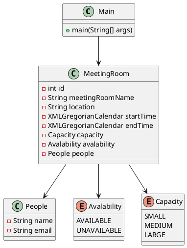

# LLD-Meeting-Room-Schedular

### README

# Meeting Room Booking System

## Overview
This project is a simple console-based application for booking meeting rooms. It allows users to view available meeting rooms, book a room by entering the room name, and specify the booking details such as the start and end time, and the person booking the room.

## Features
- List available meeting rooms
- Book a meeting room
- Enter booking details (person name, email, start time, end time)
- Send notification to the person who booked the room

## Technologies Used
- Java
- XMLGregorianCalendar for date and time handling

## How to Run
1. Clone the repository.
2. Open the project in IntelliJ IDEA.
3. Run the `Main` class.

## Sample Input
- Start time: `2023-10-15T09:30:00`
- End time: `2023-10-15T10:30:00`

## Classes
- `Main`: The main class that contains the logic for booking meeting rooms.
- `MeetingRoom`: Represents a meeting room with attributes like name, location, capacity, availability, and booking details.
- `People`: Represents a person with attributes like name and email.
- `Enums.Avalability`: Enum for room availability status.
- `Enums.Capacity`: Enum for room capacity.

## UML Diagram

